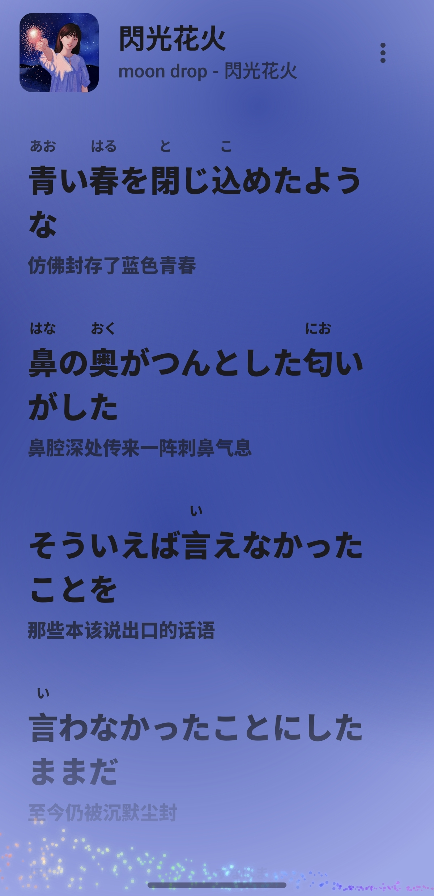

# Lyrico 日语歌词源插件

给 [Lyrico](https://github.com/Replica0110/Lyrico) 用的歌词源插件，专门搜日语歌词，并自动为汉字加上注音（フリガナ）。Lyrico 导出 TTML 时带 `tts:ruby` 注音。*现已支持批量匹配*
*如果需要数字也注音的话请在插件设置里打开*

只提供歌词源，不包含元数据搜索和封面搜索。只返回日语歌词，中文等其他语言的歌词不会出现在搜索结果里。*批量匹配时会跳过*

歌词源的基础代码来自 Replica0110 的 [Lyrico-Plugins](https://github.com/Replica0110/Lyrico-Plugins)。

| 目录 | 插件 | ID |
| --- | --- | --- |
| `japanese-lyrics-furigana/` | 日语歌词源插件 | `com.lyrics.source.japanese.furigana` |

需要 Lyrico 插件 API 5。

## 效果

在开源播放器 [RawS Music](https://github.com/QFDY-GZC/RawS-Music) 里显示的效果：

## 安装

去 [Releases](../../releases) 下载 zip，在 Lyrico 里导入。歌词模式选择 TTML 歌词

## 使用须知

**搜索时间可能会很长，请耐心等待** 请求比普通的歌词源多，网络慢的时候要等一会儿。为避免被 Lyrico 判超时，超时的话这注音正确率会下降，或者不注音。

- **要在 Lyrico 的「歌词模式」里选 TTML，才会带上振假名**
- **歌词显示需要支持 TTML 歌词的播放器**

## 注音原理

读音只取自平台自带的罗马音，转成平假名后，和原文里的假名对齐，汉字夹在中间的部分就是它的读音。不用词典。
连续汉字被拆成单字的时候（比如逐字歌词里的「特」「別」），罗马音不知道该在哪切开，这时用一张汉字读音表帮忙挑切分。表只用来挑，读音本身不是从表里来的。熟字训（「今日」「時計」等）读音分不到每个字，就把这几个字合并成一个词整体注音。

对不上、有歧义的地方可能就不会标注。

其他几点：

- 只多加一层注音，原文、逐字时间、行时间和翻译都不动。
- 作词、作曲、编曲这类署名行，还有开头的歌名行，不注音。
- 日语歌词会标上 `language = "ja"`。

## 已知的问题

- 平台不是每首日语歌都有罗马音，没有就注不上。
- 平台罗马音本身的错误会照原样保留（比如少写、多写音节，或者把「一日」写成「tsuitachi」），对不上文字的整行会被跳过。
- 歌词里混进简体中文字的行（偶尔会这样）整行不注音。
- Lyrico 的「中文文本转换」设成繁体转简体时，会把日文汉字也转掉（「僕」→「仆」）。
- 日文汉字歌词显示问题，Unicode 代码一样的日文汉字和繁体中文汉字会显示成繁体中文汉字。此问题是歌词显示/播放软件方面的问题。

## 关于这个项目

在 Replica0110 的 [Lyrico-Plugins](https://github.com/Replica0110/Lyrico-Plugins)基础上由 Claude Code 开发，包括对齐算法和打包。

## 反馈

如有问题，请通过 [Issues](https://github.com/luitao666-arch/lyrico-furigana-plugins/issues) 联系。

## 致谢

- 插件的基础代码来自 Replica0110 的 [Lyrico-Plugins](https://github.com/Replica0110/Lyrico-Plugins)。
- 汉字读音表来自 KANJIDIC（© EDRDG），经 [kanji-data](https://github.com/davidluzgouveia/kanji-data) 整理，按 CC BY-SA 4.0 使用，改动说明见文件头。

署名和链接的详细信息见 [THIRD_PARTY_NOTICES.md](./THIRD_PARTY_NOTICES.md)。
